# KrishiDoc full product audit and redesign

**Audit date:** 2026-08-04  
**Repository state reviewed:** branch `v2`, commit `80eeeff`  
**Scope:** all 180 tracked files, current Flutter application, pure Dart packages, FastAPI backend, Android shell, localization, tests, CI, ADRs, specifications, review documents, dependencies, and five launcher assets.

## Executive decision

KrishiDoc should not become a menu containing every agricultural service. It should become the farmer's **daily decision companion**:

> Tell me what needs attention today, help me understand a crop problem, and let me act safely—even without internet.

The repository has unusually strong engineering discipline around honesty, offline behavior, localization, accessibility, and inference uncertainty. The current releasable product, however, is only a local leaf-photo notebook. Diagnosis is an explicitly non-distributable sample path, advice content does not exist, the client never calls the backend, and the backend loses its data on restart.

The redesign therefore follows three product rings rather than launching an all-in-one dashboard at once:

1. **Trusted crop-help core:** offline handbook, real diagnosis, reviewed actions, photo history, and a working human escalation path.
2. **Daily farm loop:** lightweight farm/crop setup, actionable weather, tasks, reminders, and market prices.
3. **Connected ecosystem:** soil, irrigation, inventory, finance, government services, expert consultation, and carefully separated commerce.

Satellite analytics, community, loans, insurance, and marketplace transactions are valid future modules, but putting them on Home before the trusted core works would recreate the repository's documented V1 failure: impressive surface area with no dependable path to value.

---

## 1. Repository architecture overview

### 1.1 Current project map

```text
krishidoc/
├── app/                         Flutter Android-first farmer application
│   ├── lib/main.dart            startup, locale restoration, app shell
│   ├── lib/src/
│   │   ├── welcome/             language choice and About
│   │   ├── capture/             camera, live quality gate, crop picker
│   │   ├── diagnosis/           result presentation and photo storage
│   │   ├── notebook/            releasable photo notebook
│   │   ├── home_screen.dart
│   │   ├── history_screen.dart
│   │   ├── providers.dart       Riverpod composition
│   │   └── router.dart          nine routes
│   ├── lib/l10n/                63 strings in English, Nepali, and Hindi
│   ├── test/                    widget and behavior tests
│   ├── integration_test/        camera, device, typography, review suites
│   └── android/                 API 23+, camera/internet permissions
├── packages/
│   ├── core_domain/             Flutter-free entities and repository ports
│   ├── core_data/               Drift/SQLite database and stores
│   ├── capture/                 image preparation and quality assessment
│   ├── inference/               model packs, calibration, tri-state resolver
│   └── design_system/           tokens, type, theme, result components
├── backend/
│   └── src/krishidoc/
│       ├── modules/identity/    device registration and token rotation
│       └── platform/            config, errors, ids, idempotency, logging
├── docs/
│   ├── adr/                     D-00 through D-55 registry
│   ├── reviews/                 six Module-12 product/design reviews
│   ├── seams/                   clinics, IoT, marketplace boundaries
│   └── specs/                   first-contact and unbuilt handbook specs
└── .github/workflows/ci.yml     hygiene, Dart/Flutter, and Python gates
```

### 1.2 Architectural strengths to retain

- Flutter-free core packages make the model, database, capture, and inference logic independently testable.
- Concrete stores are composed in one place; screens use domain ports rather than Drift directly.
- Invalid diagnosis states are difficult to represent: confident, uncertain, and out-of-scope records enforce different invariants.
- UUIDv7 identities are created offline.
- Captured images are oriented, reduced to a 1024 px long edge, re-encoded, and stripped of EXIF before storage.
- Inference output is temperature-calibrated and checked against per-class thresholds, an open-set rejection floor, and a near-tie margin.
- The sample model is honestly and permanently marked through `sample-*` model versions.
- The design system uses explicit, tested colors instead of a generated Material seed palette.
- English and Devanagari use different line-height and letter-spacing columns.
- CI enforces formatting, analysis, package purity, repository hygiene, secret scanning, tests, Python typing, linting, and minimum backend coverage.

### 1.3 Architectural gaps

| Priority | Gap | Evidence and consequence |
|---|---|---|
| **Critical** | No production inference runtime or trained model | `ImageClassifier` is only a port; production wiring uses `SampleClassifier`, which hashes image bytes. Diagnosis cannot ship. |
| **Critical** | No advisory knowledge base | There is a detailed handbook specification but no `content/`, `tools/kb`, KB database, asset pack, or handbook route. A diagnosis has no safe action attached. |
| **Critical** | Backend state is in-memory | Device identities and idempotency responses disappear on process restart. The API is development-grade only. |
| **Critical** | Flutter app has no API client | No HTTP dependency, generated OpenAPI client, auth key management, sync service, or network-state layer exists. |
| **Critical** | Startup can end on a black screen | Database and photo-store initialization are awaited before `runApp` with no recovery surface. |
| **Critical** | Release build is signed with the debug key | Android release configuration explicitly uses the debug signing configuration. |
| **High** | Result actions promise destinations that do nothing | “See crop experts near you” and “This is not what my leaf has” have no-op handlers. |
| **High** | No durable server database, migrations, or deployment configuration | PostgreSQL, Redis, Alembic, containers, Terraform, and runtime manifests are planned but absent. |
| **High** | No photo lifecycle owner | Deleting a notebook row deliberately leaves the JPEG behind; failed row writes can also leave orphan files. There is no sweep or storage budget UI. |
| **High** | No signed content/model pack mechanism | Pack registry, signature verification, rollback, kill switch, delta updates, and Play Asset Delivery are decisions only. |
| **Medium** | Router has no not-found/error experience | Unknown or malformed deep links have no product-specific recovery route. |
| **Medium** | Documentation contains decision-number conflicts | `SPEC-handbook-shell.md` proposes D-52–D-58, while D-52–D-55 now mean different accepted decisions. Those proposed numbers must never be copied into new ADRs. |
| **Low** | Root README metadata is stale | It says 51 decisions although the registry reaches D-55. |

### 1.4 Hidden, experimental, incomplete, and unused surface

**Hidden/experimental**

- Debug Home exposes sample diagnosis and a six-state result preview.
- Compile-time `KD_LOCALE` and `KD_FIRST_RUN` switches support screen review.
- Device integration tests measure quality-gate and image-preparation budgets.
- Review integration tests deliberately hold screens for human inspection.

**Incomplete**

- `ConsentScope` and `Jurisdiction` are domain types with no product or persistence flow.
- Clinic, IoT, and marketplace documents are seams, not implementations.
- Crop catalog contains only hardcoded tomato, potato, and maize placeholders.
- History and results derive English display text from classifier label keys.
- Android has no production app signing, adaptive icon, branded splash art, backup policy, or privacy/security configuration.

**Unused or future-facing code**

- `KdElevation` and `KdMotion` are defined but currently have no meaningful consumers.
- `assertNotSample` is tested but not installed as a production release-build guard.
- `ImageClassifier.dispose()` is never part of application lifecycle wiring.
- `AppServices.dispose()` is not called from `main`.
- Several repository methods exist mainly for tests while screens use reactive variants.
- `Registration.created` and the backend `json_body` helper are not used by production routes.

**Duplication**

- The diagnosis and observation photo widgets repeat nearly identical memory-image loading/error behavior.
- Empty History and empty Notebook repeat the same icon/title/body structure.
- Generic loading and error states are rebuilt screen by screen.
- Home destination and not-ready rows share most layout structure.

These are modest today. Extract them only when their behavior is settled; premature componentization would hide product differences behind generic APIs.

---

## 2. Existing feature inventory

| Capability | Release status | What actually works |
|---|---|---|
| First-run language selection | **Working** | One-tap Nepali/Hindi/English choice, persisted locally. |
| About/trust explanation | **Working** | Coverage, not-ready state, offline and on-device statements. |
| Language switching | **Working** | Home AppBar menu with current-language check. |
| Field photo notebook | **Working** | Capture an acceptable leaf photo, save it offline, add/edit a note, browse recent entries, delete the row. |
| Camera quality coaching | **Working, provisional thresholds** | Blur/dark/bright assessment from Y plane; disables shutter until accepted. |
| Image privacy preparation | **Working** | Orientation baked, resize, JPEG encode, EXIF removal on a background isolate. |
| Crop context | **Working, provisional catalog** | Remembers tomato/potato/maize selection. |
| Diagnosis | **Internal demonstration only** | Sample classifier creates all three result states but is agronomically meaningless. |
| Diagnosis history | **Internal demonstration only** | Stores and reopens sample diagnoses. |
| Human escalation | **False affordance** | Button renders but callback does nothing. |
| Correction feedback | **False affordance** | Button renders but callback does nothing. |
| Device identity API | **Local/dev only** | Registers Ed25519-shaped keys and issues rotating JWTs using in-memory state. |
| Idempotency and request IDs | **Local/dev only** | Consistent middleware and error envelope, with in-memory replay state. |
| Offline handbook/advice | **Specified, absent** | Detailed spec exists; no implementation or content. |
| Sync/account/OTP | **Absent** | Decisions only. |
| Weather, market, soil, irrigation, finance, inventory | **Absent** | No models, screens, services, or data feeds. |
| Expert booking/chat, community, schemes, marketplace | **Absent or seam only** | No implementation. |

---

## 3. Agriculture domain audit

### 3.1 Workflows supported today

1. Choose a reading language.
2. Read the application's current limitations and privacy posture.
3. Choose one of three crops.
4. Photograph a leaf when the quality gate accepts the frame.
5. Save the photograph and optional note as a dated observation.
6. Review or delete notebook observations.
7. Internally demonstrate—not release—a tri-state sample diagnosis.

This is useful as a field diary, but it is not yet a crop-health service.

### 3.2 Missing workflows and recommended sequence

| Module | Farmer value | Dependency/risk | Recommended phase |
|---|---|---|---|
| Offline disease/pest handbook | Immediate help without model or network | Agronomist content throughput and licensed photos | **Now** |
| Real crop doctor | Fast path from symptom to likely cause | Trained/calibrated model, field validation, KB mapping | **Now, after handbook foundation** |
| Human/clinic directory | Safe exit when uncertain or high-value crop | Verified directory and stale-data policy | **Now** |
| Actionable weather | Daily reason to return; spray/irrigation safety | Reliable location and provider, cache/freshness UX | **Next** |
| Crop cycles and tasks | Turns advice into remembered work | Simple farm/crop model and reminders | **Next** |
| Market prices | High-frequency economic value | Trusted mandi/market sources and freshness | **Next** |
| Soil report capture and recommendations | Input planning | Lab formats, OCR review, agronomist rules | Later |
| Irrigation planner | Saves water/labor | Weather, crop stage, soil context | Later |
| Expenses, income, inventory | Farm management and trust | More data entry; must remain lightweight | Later |
| Government schemes/insurance | Access to entitlements | Frequently changing jurisdiction data | Later |
| Live expert consultation | Complex problem resolution | Supply, scheduling, payment/support operations | Later |
| Marketplace | Input access | Licensing, counterfeit risk, logistics, conflicts of interest | Partner-triggered |
| Satellite imagery/field mapping | Scouting prioritization | Field boundaries, cloud cover, cost, map literacy | Advanced |
| Community | Peer learning | Moderation, misinformation, abuse, connectivity | Advanced |
| Loans/insurance underwriting | Financial access | Regulation, consent, high-stakes data use | Separate regulated program |
| Livestock | Valuable but different domain model and expertise | Would dilute crop-health focus | Separate product track |

### 3.3 Product principle

Every new module must answer one of three questions:

- **What needs attention today?** Weather, tasks, outbreaks, crop stage.
- **What is happening to my crop?** Doctor, handbook, field observations, expert.
- **What should I do or decide next?** Safe actions, reminders, market timing, inputs.

If a feature cannot answer one of those clearly, it belongs under More, in a partner portal, or outside the farmer application.

---

## 4. Screen-by-screen UX and UI audit

### 4.1 Current screens

| Screen/state | What works | Issues and priority | Redesign recommendation |
|---|---|---|---|
| Language chooser | Excellent single decision, large targets, endonyms, correct script metrics, durable write, TalkBack action | No brand recognition or visual explanation (**Low**). App name itself remains Latin (**Medium**). | Keep the interaction. Add a small, non-verbal KrishiDoc mark and optional “hear language name” control only after field research. |
| About, first run | Honest, short, offline/private facts; primary button stays visible | Explains absence more than value (**Medium**); no cost statement (**Medium**); no later progressive onboarding for camera/certainty (**High when diagnosis ships**). | Retitle as “How KrishiDoc helps.” Teach only live features. Add one illustrated camera lesson when real diagnosis launches. |
| Home | Honest rows, no dead snackbar, notebook first, localized, responsive | It is a launcher rather than a daily dashboard (**High**); History is empty in release (**Medium**); debug entries are mixed into Home in debug (**Low**); no persistent nav (**High for target platform**). | Replace with Today: urgent weather, active crop, one task, crop-health status, market snapshot, and one primary Doctor action. |
| Notebook list | Real offline value, image-led rows, persistent capture action | It is leaf-only rather than a general farm observation timeline (**Medium**); no filter/search/grouping (**Medium**); missing photo has no explanation (**Low**). | Evolve into Farm Diary grouped by field/crop/date; retain quick camera entry and offline behavior. |
| Observation detail | Photo, date/crop, editable note, confirmation before delete | Save failure has no visible error (**High**); deletion leaks the photo file (**High**); fixed TextField model is thin (**Medium**); “cannot be undone” is misleading while bytes remain (**Medium**). | Add typed save states, delete file ownership, tags/field/stage, and a visible “saved on this phone” storage status. |
| Camera start/failure | Real camera port, honest text error | Blank preview before first frame (**Medium**); permission denied and no hardware share one message (**High**); no retry/open settings (**High**). | Model initializing, permission-denied, restricted, and no-hardware states separately. Add Try again and Open settings actions. |
| Camera coaching | One instruction, opaque high-contrast banner, safe-area shutter, remembered crop | 5 Hz state can chatter and make the shutter flicker (**High**); no hysteresis or minimum message hold (**High**); disabled shutter swallows taps (**High**); no manual override (**High**); crop defaults silently (**High for real diagnosis**); no torch/tap focus/gallery import (**Medium**). | Use 2-of-3 arm / 3-of-3 disarm hysteresis, 900 ms message hold, tactile/visible refusal, first-use explicit crop confirmation, torch, focus, and gallery import. |
| Capture processing | Off-UI image work; double-tap guard | 1–2 second wait has only disabled state and no staged progress (**High**); errors collapse to one generic line (**Medium**); photo-first/database-second can orphan files (**Medium**). | Freeze captured frame, show “Photo taken → Checking,” delay spinner for short waits, classify typed errors, and queue orphan cleanup. |
| History | Loading/error/empty states, state semantics, sample marker, tappable rows | Raw model labels are shown in English (**Critical before real release**); no retry on error (**High**); dates are overly precise (**Low**); list is diagnosis-only and separate from observations (**Medium**). | Use reviewed KB names, thumbnail + state phrase + crop + relative date, error retry, filters, and optionally a unified activity timeline. |
| Diagnosis result | Shows farmer's photo; honest tri-state language; sample notice; actions structurally present | Both human and correction actions are no-ops (**Critical**); no treatment/advice (**Critical**); label display is English stopgap (**Critical**); no source/version/freshness UI (**High**); “saved” is separated from the next action (**Medium**). | Result order: answer → confidence explanation → compare photo → do now → avoid → watch → expert/correction → source/freshness → follow-up reminder. |
| Result preview | Valuable living documentation for six states | Debug route has no hard release route guard, only Home visibility (**Medium**). | Keep behind explicit debug routing or compile it out of release builds. |
| Crop picker sheet | Simple, titled, selected state visible | Only three rows; no search, “not listed,” or explanation of why crop matters (**High for real diagnosis**). | Add “My crop is not here,” coverage explanation, recent crops, and derive list from installed packs. |
| Delete confirmation | Simple and localized | Destructive action has no haptic and file is not deleted (**Medium**). | Use destructive visual style, haptic, and atomic row/file cleanup with recoverable undo if practical. |

### 4.2 Current component audit

| Component family | Status | Findings |
|---|---|---|
| Buttons | Good base | Filled, outlined, and text buttons have a 48 dp minimum. Destructive style, progress state, and icon-only policy are not centralized. |
| Cards | Good base | Explicit border works outdoors; zero implicit margin prevents spacing drift. Avoid turning every dashboard fact into a card. |
| Inputs | Underdeveloped | Only one multiline note field exists. Error, helper, unit, date, number, voice-entry, and offline-save patterns are absent. |
| Menus/dropdowns | Adequate | Language popup is good. Crop sheet needs coverage and unsupported-state handling. |
| Navigation | Insufficient for target | Flat GoRouter list, no shell route, no bottom navigation, no deep-link error, no authenticated/restoration state. |
| Tabs | Absent | Use sparingly inside Market or Weather; do not use tabs as primary navigation. |
| Dialogs/sheets | Minimal | One delete dialog and one crop sheet. Standardize confirmation, permission education, stale-data, and offline conflict sheets. |
| Icons | Functional chrome, no brand | Launcher is the stock Flutter logo. Material icons are acceptable for navigation but not for representing plant pathology. |
| Charts | Absent | Start with directly labeled weather and price sparklines; avoid dense analytics on Home. |
| Maps | Absent | Defer until field or clinic workflows justify location permission and offline tiles. |
| Camera | Strong engineering base | Needs stable coaching, permission recovery, torch/focus/gallery, processing choreography, and field validation. |
| Weather cards | Absent | Must express action (“Safe to spray 6–8 AM”), source, location, and freshness—not just numbers. |
| Disease/advice cards | Diagnosis state exists; advice absent | Preserve tri-state honesty. Add KB-driven action cards; never generate chemical doses. |

---

## 5. Accessibility audit

### 5.1 Strong existing behavior

- Most interactive targets meet or exceed 48 dp.
- Diagnosis state is expressed through words, glyph, layout, semantics, and color—not color alone.
- Tested contrast is materially stronger than baseline WCAG AA to survive outdoor glare.
- Devanagari has zero letter spacing and taller line metrics.
- Home and onboarding are tested across 320×640, 360×800, 412×915, landscape, three languages, and text scales up to 2.0.
- Dynamic camera coaching is a live region.
- Haptics are supplementary and respect device settings.
- Custom durations have a reduced-motion helper available.

### 5.2 Gaps

| Priority | Accessibility gap | Required change |
|---|---|---|
| **Critical** | Action buttons can be announced and activated while doing nothing | Never render a semantic action without a real outcome. |
| **High** | No audio/read-aloud path for low-literacy users | Add human-recorded handbook/result audio; add device TTS fallback with clear labeling. |
| **High** | No bundled Devanagari font | Bundle a reviewed Noto Sans Devanagari subset so glyph metrics are deterministic. |
| **High** | Default fixed-height AppBar titles can clip at 200% in Devanagari | Clamp toolbar title scale while repeating the full scalable heading in the scroll body. |
| **High** | Camera live region can announce unstable messages at 5 Hz | Add hysteresis and a minimum message hold before accessibility announcements. |
| **High** | Error states do not consistently expose retry/recovery actions | Create a common stated-error component with one clear recovery action. |
| **Medium** | No dedicated outdoor/high-contrast preference | Test whether the already-high-contrast default is sufficient; offer an outdoor mode only if field testing shows value. |
| **Medium** | No dark theme despite system preference | Add a true dark scheme after outdoor light mode is stable; never show a dark launch screen followed by light UI. |
| **Medium** | Images have no farmer-facing semantic descriptions | Persist reviewed alt text for reference photos; identify the user's photo as “Photo you took.” |
| **Medium** | No switch-control/keyboard traversal suite | Add semantics-order, switch access, and hardware keyboard tests for all primary flows. |

Accessibility target: WCAG 2.2 AA as a minimum, 200% text without loss, TalkBack completion of every core flow, reduced motion, high-contrast outdoor legibility, and no essential action that depends solely on reading, color, sound, or haptics.

---

## 6. Competitor comparison and lessons

This comparison uses current official product material. It is a capability comparison, not a claim that every competitor feature works equally well in Nepal or India.

| Platform | Current strength | What KrishiDoc should learn | What not to copy now |
|---|---|---|---|
| [Plantix](https://plantix.net/en/) | Photo diagnosis, treatments, crop library, disease alerts, expert community, fertilizer calculator | A single fast crop-doctor path backed by a browsable knowledge library and human help | Broad treatment claims or commerce before local agronomy and regulation gates |
| [OneSoil](https://help.onesoil.ai/en/articles/5237584-how-the-onesoil-web-and-mobile-apps-differ) | Field-centric scouting, NDVI, notes/photos, weather, spraying windows, offline mobile sync | The field is the durable context; mobile is for field work and offline observations | Precision-ag complexity and subscriptions before smallholder daily value |
| [John Deere Operations Center](https://operationscenter.deere.com/) | Unified machine/work data accessible across web and mobile | A single farm record can integrate sources later | Machinery-first information architecture |
| [Climate FieldView](https://dev.fieldview.com/) | Field data collection, imagery, analysis, input planning, partner integrations | Separate collection, insight, and action layers | Enterprise prescriptions and machinery coupling |
| [Cropin](https://www.cropin.com/intelligent-agriculture-cloud/) | Farm digitization plus integrated weather, satellite, IoT, prediction, and enterprise data services | Keep farmer app, data platform, and intelligence services modular | Enterprise dashboard density and “AI everywhere” positioning |
| [Microsoft FarmVibes.AI](https://www.microsoft.com/en-us/research/articles/farmvibes-ai/) | Fusion of satellite, drone, weather, sensor, and machinery data for research workflows | A future intelligence layer should combine evidence rather than treat one signal as truth | Presenting a research toolkit as a farmer product |
| [Kisan Suvidha](https://www.pib.gov.in/newsite/PrintRelease.aspx?lang=2&reg=48&relid=186555) | Weather, market prices, plant protection, advisories, dealer/lab directories, soil cards, insurance, schemes | Weather, market, government, and nearby-service data are locally essential—not secondary extras | A directory of unrelated government modules with no daily prioritization |
| [AgroStar](https://corporate.agrostar.in/solutions/farm-advisory) | Local-language AI diagnosis, weather, education, human advisory, and input marketplace | Pair automation with humans and snackable learning; keep local language central | Blending advisory ranking with product-selling incentives without a hard trust boundary |
| [AgriApp](https://agriapp.com/en/aboutus) | Expert advisory, soil services, crop calendars, localized support, marketplace | Crop calendars and expert support can create repeat use | Starting commerce before safe advisory content |
| [FarmERP](https://digital.farmerp.com/) | Operations, inventory, finance, workforce, traceability, offline data collection | Later farm-record modules need a shared crop-cycle data model | ERP complexity in a first-time smartphone experience |
| [Farmonaut](https://farmonaut.com/about-us-farmonaut) | Satellite crop health, soil moisture, AI advisory, traceability, insurance support | Satellite can prioritize scouting after fields exist | Treating NDVI as a leaf-level diagnosis |

### Competitive conclusion

KrishiDoc cannot win through feature count. It can win through a combination the repository is already designed for:

- honest uncertainty instead of forced answers;
- useful operation without internet;
- reviewed Nepali/Hindi content and audio;
- fast recovery to a human;
- low-end Android performance;
- clear provenance and jurisdiction control for advice.

---

## 7. Target personas

### Persona A — Maya, smallholder and primary operator

- 41, Nepal hills, tomato/maize, shared Android phone, intermittent data.
- Reads Nepali slowly; prefers pictures and audio.
- Needs: “Can I wait?”, “What can I do today?”, “Who can confirm this?”
- Failure to avoid: technical dashboards, silent disabled controls, chemical advice without local context.

### Persona B — Ramesh, market-oriented smallholder

- 33, northern India, potato/tomato, uses WhatsApp and digital payments.
- Checks weather and prices daily; willing to record tasks if the return is visible.
- Needs: spray window, outbreak risk, market timing, input and expense history.
- Failure to avoid: data entry before value and stale prices without timestamps.

### Persona C — Sita, low-literacy shared-device user

- 52, seasonal vegetables; relies on family for complex phone tasks.
- Recognizes crops and visual symptoms but struggles with menus.
- Needs: stable locations, large targets, voice, photos, few decisions.
- Failure to avoid: reordered navigation, icon-only meaning, text-dense advice.

### Persona D — Anil, extension worker/agronomist

- Supports hundreds of farmers and multiple languages.
- Needs: reproducible diagnosis context, photo, model/content version, location only with consent, referral queue, correction feedback.
- Failure to avoid: unstructured chat with no provenance or audit trail.

---

## 8. Redesigned information architecture

### 8.1 Primary navigation

Use a five-destination `StatefulShellRoute` with preserved stacks:

1. **Today** — prioritized daily decisions.
2. **My Farm** — fields, crops, diary, tasks, soil, inventory.
3. **Doctor** — visually prominent center destination; camera and symptom browse.
4. **Market** — nearby prices, trends, saved crops.
5. **More** — learn, experts, schemes, notifications, settings, sync, privacy.

Do not add a second global FAB on top of the center Doctor action. It would duplicate the highest-emphasis action. Use contextual FABs only where the verb changes predictably: Add observation in My Farm, Add expense in Finance.

```mermaid
flowchart TD
    App["KrishiDoc"] --> Today["Today"]
    App --> Farm["My Farm"]
    App --> Doctor["Doctor"]
    App --> Market["Market"]
    App --> More["More"]

    Today --> Weather["Actionable weather"]
    Today --> Tasks["Today's tasks"]
    Today --> Alerts["Crop and outbreak alerts"]
    Today --> Snapshot["Market snapshot"]

    Farm --> Fields["Fields and crop cycles"]
    Farm --> Diary["Photo diary"]
    Farm --> Calendar["Calendar and reminders"]
    Farm --> Soil["Soil reports"]
    Farm --> Records["Finance and inventory"]

    Doctor --> Camera["Take a photo"]
    Doctor --> Symptoms["Browse by symptom"]
    Doctor --> Handbook["Disease and pest handbook"]
    Doctor --> History["Past checks"]
    Doctor --> Expert["Ask an expert"]

    Market --> Prices["Nearby prices"]
    Market --> Trends["Price trends"]
    Market --> Watchlist["Saved crops"]

    More --> Learn["Learning center"]
    More --> Schemes["Schemes and insurance"]
    More --> Clinics["Experts and services"]
    More --> Settings["Language, accessibility, offline, privacy"]
```



### 8.2 Today hierarchy

Home should answer “what matters now” in this order:

1. Offline/sync and active location context, quietly.
2. One urgent alert, only if urgent.
3. Primary Doctor action.
4. Weather action window: rain, spray, irrigation, heat/frost.
5. Today's next task.
6. Active crop health and recent observation.
7. Saved-crop market snapshot.
8. Seasonal recommendation and learning item.

Government notifications, AI assistant, and promotions do not get permanent Home sections. They appear only when relevant and dismissible.

### 8.3 Search

- Global search lives under Doctor and More until content breadth justifies app-wide search.
- Search offline KB, crops, symptoms, experts, and settings locally.
- Market and government search require their own filters and freshness; do not mix them into clinical results.
- Romanized Nepali/Hindi variants are reviewed synonyms, not guessed transliteration algorithms.

---

## 9. Target user journeys

### 9.1 First useful minute

1. Select language.
2. Read one screen: works offline, photos stay on phone, what crops are covered.
3. Land on Today with “Check a crop” as primary action and “Browse crop help” as offline alternative.
4. No account, location, farm boundary, jurisdiction, or notification permission is required before value.

### 9.2 Diagnose a crop offline

1. Doctor → Take a photo.
2. Confirm remembered crop or choose “not listed.”
3. Stable coaching; shutter becomes ready.
4. Frozen photo and staged progress.
5. Result states:
   - confident: reviewed name, confidence sentence, compare images, safe “Do now” actions;
   - uncertain: top alternatives, comparison guide, expert;
   - out of coverage: exact limit, handbook/clinic path, no futile retake.
6. Save follow-up for two days; result remains available offline.

### 9.3 Daily weather decision

1. Today says “Do not spray this afternoon—rain likely at 3 PM.”
2. Tap for hourly evidence, source, update time, and next safe window.
3. Add a task/reminder without re-entering crop or field.
4. Cached forecast remains visible offline with “updated 2 hours ago.”

### 9.4 Market decision

1. Market opens to saved crops and nearest configured markets.
2. See current range, source, update time, and seven-day trend.
3. Compare markets; no unsourced “best time to sell” prediction.
4. Optional alert when price crosses a farmer-chosen threshold.

### 9.5 Expert escalation

1. Result carries photo, crop, date, result state, model/content versions.
2. Farmer selects call, visit, or submit case according to available partner.
3. Sharing preview shows exactly what will leave the phone.
4. Explicit consent grants a scoped, expiring case link.
5. Expert response becomes a correction/addendum, never silently overwrites history.

---

## 10. Screen redesign recommendations

### Today

- Use one strong summary sentence and a short action list, not a grid of equal cards.
- Weather card must lead with an action window, then supporting numbers.
- Market snapshot shows only saved crops and freshness.
- Empty state prompts lightweight crop setup, not full farm registration.

### Doctor hub

- Two primary paths: Take a photo and Browse by what you see.
- Show supported crops at rest.
- Provide recent checks and offline handbook entry.
- Expert route must describe availability, cost, connection need, and last directory verification.

### Result

- Never use a naked percentage as the headline.
- Always show the farmer's photo and reviewed comparison photo.
- Separate “Do now,” “Do not,” “Watch,” and “Get help.”
- Organic/biological and cultural actions precede chemical actions.
- Chemical cards require active ingredient, jurisdiction, dose basis, PPE, re-entry, pre-harvest interval, source, validity, and local verification. The LLM never authors these values.
- Offer “This does not match my crop” and save feedback locally if offline.

### My Farm

- Begin with crops, not map boundaries.
- Field geometry is optional and introduced only when weather/satellite precision benefits are explained.
- Diary unifies observations, diagnoses, actions, and expert addenda.
- Crop-cycle setup asks crop + approximate planting date first; everything else is progressive.

### Weather

- Default to next safe action, then daily/hourly detail.
- Show rain probability and amount separately.
- Include wind and humidity where spraying is concerned.
- Clearly label provider, location granularity, update time, and cached/offline state.

### Market

- Save crops and markets; avoid national commodity clutter.
- Use price ranges and source timestamps.
- Trend charts are directly labeled and accessible as a text summary.
- Marketplace offers, if introduced, remain visually and algorithmically separate from neutral price information.

### More/Profile

- Groups: Help & learning; Services; App & language; Data & privacy; Offline storage & sync.
- Device/account state should say “Using this phone” before asking for phone continuity.
- Permissions page explains value before linking to OS settings.

---

## 11. Wireframe recommendations

### Today

```text
┌──────────────────────────────┐
│ KrishiDoc      Offline ✓  🔔 │
│ Good morning                  │
│ Tomato · Chitwan              │
├──────────────────────────────┤
│ [ Check a crop ]              │
│ Take a photo or browse signs  │
├──────────────────────────────┤
│ WEATHER · updated 20 min ago  │
│ Rain likely after 3 PM        │
│ Best spray window: 6–9 AM  ›  │
├──────────────────────────────┤
│ TODAY                         │
│ ○ Check lower leaves          │
│ ○ Irrigate maize plot         │
├──────────────────────────────┤
│ TOMATO PRICE                  │
│ ₹/रु 34–39 kg · Kalimati  ›   │
├──────────────────────────────┤
│ Today  Farm  Doctor Market ⋯  │
└──────────────────────────────┘
```

### Doctor

```text
┌──────────────────────────────┐
│ Crop Doctor                   │
│ Tomato · Potato · Maize       │
├──────────────────────────────┤
│ [ 📷 Take a photo ]           │
│ Works without internet        │
├──────────────────────────────┤
│ [ Browse by what you see ]    │
│ Spots · yellowing · holes     │
├──────────────────────────────┤
│ Recent checks                 │
│ [leaf] Not sure · Tomato   ›  │
│ [leaf] Late blight         ›  │
├──────────────────────────────┤
│ Handbook     Crop experts     │
│ Today  Farm  Doctor Market ⋯  │
└──────────────────────────────┘
```

### Result

```text
┌──────────────────────────────┐
│ Result                        │
│ [ photo you took ]            │
├──────────────────────────────┤
│ ✓ This looks like late blight │
│ A photo cannot be certain.    │
├──────────────────────────────┤
│ Compare with reference photo  │
│ [ reference ]  What to look › │
├──────────────────────────────┤
│ DO THIS NOW                   │
│ 1 Remove badly affected leaf  │
│ 2 Keep leaves dry             │
│ 3 Check nearby plants         │
├──────────────────────────────┤
│ [ Remind me in 2 days ]       │
│ [ Ask a crop expert ]         │
│ Not a match? Tell us          │
└──────────────────────────────┘
```

---

## 12. Design system specification

### 12.1 Brand direction

- Promise: **Clear crop help, even offline.**
- Personality: calm, practical, respectful, never futuristic or clinical.
- Replace the stock Flutter launcher with a distinctive leaf-and-lens mark that remains recognizable at 24 px and in monochrome.
- Keep “KrishiDoc” as the legal/Latin brand, but test a readable localized descriptor below it on first contact and store listing.
- Avoid generic farm panoramas, smiling-stock-farmer photography, glowing AI brains, and medical crosses.

### 12.2 Color

Retain the verified light palette as the base:

| Role | Token | Value |
|---|---|---|
| Canvas | `canvas` | `#F1F3EC` |
| Surface | `surface` | `#FFFFFF` |
| Strong ink | `inkStrong` | `#12140F` |
| Body ink | `inkBody` | `#1A1C19` |
| Muted ink | `inkMuted` | `#44483F` |
| Border | `border` | `#7C8474` |
| Primary | `primary` | `#1B5E20` |
| Warning | `warning` | `#8A5300` |
| Danger | `danger` | `#A61B1B` |
| Information | new audited token | Select and contrast-test before implementation |

Dark mode requires an independently measured palette; do not mechanically invert light tokens. Outdoor readability remains the primary light-mode requirement.

### 12.3 Typography

- Bundle Noto Sans and Noto Sans Devanagari subsets.
- Preserve existing sizes: 18 sp body large, 16 sp body, 14 sp supporting text, 22–24 sp screen headings.
- Devanagari: line height 1.45–1.60, zero letter spacing, even leading.
- Never uppercase Devanagari section headings.
- No essential body text below 14 sp.
- AppBar title may clamp to 1.3× only when the full screen title repeats in scalable body content.

### 12.4 Layout and touch

- 4 dp primitive spacing grid; use existing 8/12/16/20/24/32/40/56 scale.
- Page gutter 16 dp; card padding 16 dp; section gap 24 dp.
- Minimum touch target 48×48 dp; primary field actions target 56 dp height.
- Support 320 dp width and 200% text without truncation.
- Prefer content-height rows over fixed-aspect grids.
- Bottom navigation labels are always visible.

### 12.5 Shape and elevation

- 16 dp cards, 12 dp controls, 24 dp sheets/chips.
- Use borders and tonal surfaces as primary separation.
- Shadows are optional support, never the only boundary.
- No glassmorphism, blur, or translucent camera overlays.

### 12.6 Motion

- Press 100 ms; quick 180 ms; standard 250 ms; slow 350 ms.
- Camera coaching holds at least 900 ms.
- Honor reduced-motion settings by collapsing custom durations.
- Animate only state transitions that explain cause: camera ready, capture progress, sync completion, new task completion.
- No shimmer, looping celebratory motion, large subtree switchers, or camera opacity layers.

### 12.7 Component inventory to build

**Foundation**

- `KdAppBar`, `KdBottomNavigation`, `KdScreenHeading`, `KdStatusStrip`
- `KdPrimaryAction`, `KdDestructiveAction`, `KdIconAction`
- `KdAsyncState`, `KdEmptyState`, `KdOfflineState`, `KdStaleBadge`
- `KdListRow`, `KdSectionHeader`, `KdThumbnail`

**Agriculture**

- `KdCropContext`, `KdFieldContext`, `KdCropStage`
- `KdWeatherActionCard`, `KdMarketPriceRow`, `KdTaskRow`
- `KdDiagnosisStateCard`, `KdReferenceComparison`
- `KdAdviceAction`, `KdChemicalSafetyCard`, `KdSourceAndValidity`
- `KdExpertCard`, `KdSchemeEligibility`, `KdSoilMetric`

**Input**

- Voice-capable note field, numeric/unit input, date/season picker, crop picker, field picker, permission primer, and confirmation sheet.

Components accept semantic domain inputs and strings, not arbitrary color/shape/text-style overrides.

---

## 13. Backend and API improvements

### 13.1 Immediate production foundation

- Implement PostgreSQL `DeviceRepository` and Redis idempotency store.
- Add Alembic expand/contract migrations.
- Prove device-key possession through a signed server challenge before issuing tokens.
- Generate a Dart client from versioned OpenAPI and add contract-diff CI.
- Store refresh credentials in Android Keystore-backed encrypted storage.
- Add rate limiting, App Check advisory mode, audit events, health/readiness endpoints, and deployment manifests.

### 13.2 Recommended bounded contexts

```text
identity       device guest, phone continuity, sessions
farms          farms, fields, crop cycles, tasks
observations   diary records, images, diagnoses, corrections
content        KB packs, model packs, validity, revocations
advisory       weather/market/seasonal rules and delivery ledger
experts        directory, referrals, appointments, scoped case links
notifications  preferences, device tokens, campaigns, delivery
consent        server-authoritative grants and deletion workflows
```

Keep inference deployment separate from the modular API as already decided.

### 13.3 API sequence

**First network release**

- `POST /v1/devices/challenge`, `POST /v1/devices`
- `POST /v1/auth/refresh`
- `GET /v1/content/packs`, signed pack metadata/download
- `GET /v1/clinics`, cached verified directory
- `POST /v1/sync/push`, `GET /v1/sync/pull`
- `GET/PUT /v1/consent`

**Daily farm release**

- farms, fields, crop cycles, tasks
- weather/advisory cache endpoints
- market watchlists and price series
- notification preferences

**Expert release**

- referral creation, scoped upload grants, status, addenda, deletion/export

All mutations require idempotency keys; lists use opaque cursor pagination; every response has request ID and one error envelope.

---

## 14. Database improvements

### 14.1 Local databases

Use separate files:

- `app.sqlite`: farmer-owned durable data.
- `kb.sqlite`: replaceable signed content index.
- Model/photo assets: file storage with database manifests and cleanup ownership.

Add to `app.sqlite` progressively:

```text
farms, fields, crop_cycles
tasks, task_events, reminders
observations, observation_tags
diagnoses, diagnosis_predictions, diagnosis_feedback
advice_deliveries
experts_cache, weather_cache, market_cache
sync_ops, sync_cursors, tombstones
consent_cache, notification_preferences
asset_manifest, cleanup_queue
```

Replace prediction JSON with child rows before analytics/sync depends on queryability. Add content/model/threshold versions and advice ledger IDs before real diagnoses ship.

### 14.2 Server database

- PostgreSQL UUIDv7 primary keys and tenant/device ownership checks.
- PostGIS only when field geometry becomes a real feature.
- Append-only consent and advice delivery audit records.
- Partition high-volume events/observations only after measured need.
- BigQuery receives privacy-filtered event envelopes, never acts as product state.
- Redis remains ephemeral: rate limits and idempotency, not identity truth.

---

## 15. AI integration opportunities and safety boundaries

### Approved opportunities

- Quantized per-crop on-device disease/pest classifier.
- Open-set rejection and calibrated uncertainty.
- Server second opinion when connected and consented.
- Image quality and crop-plausibility gates.
- Citation-constrained KB question answering.
- On-device or low-bandwidth voice query, with text confirmation.
- Soil-card OCR that requires farmer confirmation before use.
- Weather/crop-stage rule ranking.
- Satellite anomaly prioritization after fields exist.
- Correction feedback and active-learning queues with named review.

### Forbidden or gated behavior

- No LLM-generated pesticide, dose, interval, or safety instruction.
- No confident answer when open-set or calibration criteria fail.
- No silent model fallback to another crop.
- No use of precise location, original photos, or longitudinal identity without scoped consent.
- No advisory derived from stale/revoked content without a prominent warning.
- No “yield prediction” or “best selling time” without uncertainty, source, horizon, and validation.

Every diagnosis must remain traceable to image derivative, crop context, model version, threshold set, content entry/version, and delivery time.

---

## 16. Offline-first strategy

1. **Local write first:** every farmer action gets UUIDv7 identity and commits locally before navigation.
2. **Installed value:** handbook, reference photos, supported model packs, clinic basics, and crop calendar remain available in airplane mode.
3. **Freshness is data:** weather, market, clinic, scheme, and advisory caches carry source and `updated_at`/`valid_until`.
4. **Operation log:** append mutations with hybrid logical clock, entity, field mask, and idempotency key.
5. **Sync:** batch push, cursor pull, per-field LWW where safe, server-authoritative CAS for consent, tombstones for deletion.
6. **Images:** sync prepared derivatives after metadata; originals only under research consent and Wi-Fi policy.
7. **Conflict UX:** resolve ordinary note/task conflicts silently by documented rules; surface only conflicts that change money, consent, or treatment history.
8. **Storage control:** show pack/photo size, allow safe pack eviction, and run transactional cleanup queues.
9. **Network UX:** no blocking full-screen “offline” state when cached/local work remains possible.

---

## 17. Regional language and voice strategy

- English, Nepali, and Hindi remain launch languages.
- Farmer-facing agronomy content requires native agronomist review, not only translation review.
- Bundle Devanagari font subsets and test on representative OEMs.
- Keep endonyms fixed in their own scripts.
- Domain terms live in KB rows with regional synonyms and romanized search variants.
- Add human-recorded audio first for result state, immediate actions, chemical warnings, and camera coaching.
- Device TTS is fallback, clearly indicated when voice is synthetic.
- Store audio in on-demand language packs with checksums and size controls.
- Test comprehension by teach-back, not grammatical approval alone.
- Add Bikram Sambat only after field research; use relative dates for recent events in the meantime.

---

## 18. Security and privacy improvements

| Priority | Improvement |
|---|---|
| **Critical** | Configure production release signing, protect keys outside the repo, enable Play App Signing, and remove debug signing from release. |
| **Critical** | Add proof of possession for submitted Ed25519 keys. |
| **Critical** | Sign and verify model/content packs; support rollback and kill switch. |
| **High** | Encrypt refresh token material using Android Keystore; rotate/revoke on reuse. |
| **High** | Add PostgreSQL row ownership and authorization tests for every endpoint. |
| **High** | Implement server-authoritative consent CAS, deletion cascade, export, and audit. |
| **High** | Add Cloud Armor/rate limits/App Check and abuse monitoring before public write endpoints. |
| **High** | Define Android backup behavior so private photos/tokens are not copied unintentionally. |
| **High** | Show an explicit share manifest before expert referral uploads. |
| **Medium** | Add dependency vulnerability scanning, SBOM, signed builds, provenance, and protected release environment. |
| **Medium** | Add log redaction tests and retention policies; never log image paths, tokens, phone numbers, or precise coordinates. |

---

## 19. Performance plan

- Maintain arm64 delivered install below the 60 MB starter-pack budget.
- Measure cold start, DB open, KB seed, first camera frame, shutter-to-result, and peak RSS on the 1 GB reference device.
- Add startup fallback UI without lengthening the first useful frame unnecessarily.
- Hold a long-lived image/inference worker instead of spawning an isolate at shutter time if device measurements support it.
- Rebuild only camera coaching/shutter state, not the full preview subtree, on assessments.
- Decode thumbnails at rendered size; never hold full 1024 px images for list rows.
- Cap cached weather/market series and photo counts; expose cleanup.
- Delay spinners for sub-250 ms local work to avoid flashes.
- Use static skeletons only for sustained loads; no shimmer.
- Add CI budgets for APK size, startup, inference latency, peak memory, KB seed time, and scroll frame time.

---

## 20. Prioritized technical debt register

| Priority | Work item | Acceptance condition |
|---|---|---|
| **Critical** | Startup recovery | Corrupt/locked/unavailable DB produces localized retry/reset/support screen, never black. |
| **Critical** | Remove false result actions | Buttons are hidden until real destinations exist or complete a real workflow. |
| **Critical** | Production signing | Release artifact cannot be built with debug signing. |
| **Critical** | Real diagnosis/advice gate | Release CI fails if any wired pack is sample or any diagnosis lacks valid KB mapping. |
| **Critical** | Durable backend | Restart preserves devices and refresh-chain state. |
| **High** | Photo lifecycle | Delete and failure cleanup are owned, tested, and storage-bounded. |
| **High** | Camera stabilization | No 5 Hz chatter; farmer can recover from permission, quality, and processing failures. |
| **High** | Reviewed label names | No classifier key reaches farmer-facing UI. |
| **High** | Font and app-bar scaling | All core screens pass real-device Devanagari 200% layout. |
| **High** | Branded Android shell | Adaptive icon, splash mark, store assets, app label review. |
| **Medium** | Async-state components | Loading/error/empty/retry behaviors are consistent and accessible. |
| **Medium** | Router shell and deep-link recovery | Navigation state persists per tab; bad links recover to a useful screen. |
| **Medium** | Documentation reconciliation | Handbook proposed ADRs renumbered or clearly marked non-authoritative; README count fixed. |
| **Low** | Remove duplicate startup comment and stale comments | Documentation reflects the current lifecycle and real camera implementation. |

---

## 21. Five-sprint implementation plan

Assumption: five two-week sprints, one Flutter engineer, one backend engineer, one product designer/researcher, part-time QA, ML, agronomy, and language reviewers. The five sprints create a field-testable trusted core plus the first daily-use slice; they do not complete every roadmap module.

### Sprint 1 — Trustworthy shell and release safety

**Objectives**

- Remove release blockers and false promises.
- Introduce target navigation behind feature flags.
- Make startup, camera permission, and generic errors recoverable.
- Replace stock branding.

**Files/components**

- `app/lib/main.dart`, `app_services.dart`, `router.dart`
- new `app/lib/src/shell/`, `common/async_state.dart`, startup recovery screen
- camera session typed failures and recovery UI
- Android build/signing, manifest, adaptive icons, splash resources
- design-system AppBar, status strip, bottom navigation
- README/ADR/spec reconciliation

**Dependencies**

- Final application ID, trademark decision, signing key owner, brand mark, localized error copy.

**Risks**

- Navigation churn before target modules exist; mitigate with feature flags and stable routes.
- Data-reset recovery must not become an accidental destructive default.

**Acceptance criteria**

- Release build cannot use debug signing.
- Locked/corrupt DB produces a localized recovery screen.
- Permission denied, no camera, and initialization failure are distinct, retryable states.
- Five-destination shell passes 320 dp/200%/three-locale semantics matrix.
- No production/release route reaches sample preview or no-op action.

**Effort:** 18–24 engineering days plus brand/design review.

### Sprint 2 — Offline handbook and expert safety net

**Objectives**

- Ship useful crop help without requiring ML or internet.
- Implement reviewed content pipeline and clinic directory.

**Files/components**

- new `tools/kb/`, `content/kb/`, KB core-domain models and repository
- separate `kb.sqlite`, seeder, FTS5 search
- `app/lib/src/handbook/` screens and providers
- expert/clinic directory cache and working call/directions actions
- reference photo, source, validity, stale-content components

**Dependencies**

- Licensed pathology photos; agronomist and native-language signoff; initial verified clinic data.

**Risks**

- Editorial throughput is the schedule risk.
- Existing handbook spec ADR numbers conflict and must be corrected before adoption.

**Acceptance criteria**

- Farmer reaches a reviewed “Do now” action in at most two taps from Doctor.
- Airplane-mode browse/search works in all three languages.
- Release builder refuses unsigned content, missing photos, invalid validity, and chemical content not satisfying the full safety schema.
- Clinic action reaches a real phone/directions outcome and displays verified date.
- KB is replaceable without touching farmer history.

**Effort:** 25–35 engineering days plus 20–30 agronomy/content days.

### Sprint 3 — Real crop doctor

**Objectives**

- Replace sample wiring with one validated real crop pack.
- Connect diagnosis to reviewed handbook entries and feedback.
- Stabilize capture choreography.

**Files/components**

- production LiteRT `ImageClassifier`, pack loader/signature verifier
- inference worker lifecycle and crop-plausibility gate
- capture hysteresis, torch/focus/gallery, typed progress/failures
- result redesign, advice ledger, feedback/correction, follow-up reminder
- expanded device/performance/inference eval suites

**Dependencies**

- Trained int8 model, held-out field calibration set, agronomy confusion costs, real-device lab.

**Risks**

- Model quality may fail the release bar; handbook remains the shippable product.
- Calibration and open-set performance can be worse than classifier accuracy suggests.

**Acceptance criteria**

- Release CI calls `assertNotSample` for every installed production pack.
- Model meets per-class precision/recall, calibration, open-set, latency, and memory gates.
- Every label maps to a valid reviewed KB entry or cannot be confident.
- Capture-to-result remains offline and within measured budget.
- All result actions work; no raw label key or meaningless percentage is shown.

**Effort:** 25–40 engineering/ML days plus field evaluation.

### Sprint 4 — Daily farm loop: crops, tasks, weather

**Objectives**

- Turn KrishiDoc from occasional doctor into a daily tool.
- Add lightweight crop cycles, tasks, actionable weather, and notifications.

**Files/components**

- domain/data models for farms, crop cycles, tasks, reminders, weather cache
- Today and My Farm screens
- backend farm/task/weather modules, Postgres/Alembic, generated Dart client
- notification preference and scheduling services
- weather action-card and freshness components

**Dependencies**

- Weather provider contract, location strategy, crop-stage rules, notification permission research.

**Risks**

- Over-onboarding; keep field geometry optional.
- Weather liability and provider disagreement; always show freshness/source and conservative rules.

**Acceptance criteria**

- A user creates an active crop with crop + approximate planting date only.
- Today shows no more than one urgent alert and one next task.
- Cached weather remains useful offline and visibly stale when appropriate.
- Spray/irrigation claims have agronomy-reviewed rules and tests.
- No notification permission prompt appears before the user creates a reminder or enables alerts.

**Effort:** 30–40 engineering days plus agronomy/provider work.

### Sprint 5 — Sync, market pilot, and field hardening

**Objectives**

- Preserve data across devices/connectivity.
- Add one verified market-price pilot.
- Complete field research and production hardening.

**Files/components**

- local op-log/cursors/tombstones and backend sync endpoints
- PostgreSQL device repository, Redis idempotency, proof-of-possession challenge
- encrypted credential store, consent UI/API
- Market tab, watchlist, price cache/trend/alerts for one region
- observability, SLOs, deployment, security scans, performance budgets

**Dependencies**

- Market data agreement, privacy/legal review, production infrastructure, field-test cohort.

**Risks**

- Sync correctness and stale market data can destroy trust; launch regionally and read-only first.

**Acceptance criteria**

- Offline changes retry idempotently and survive app/process restarts.
- Device re-registration and refresh reuse behave correctly against durable stores.
- Market rows always show source, market, unit, and update time.
- No unsourced forecast is presented as a selling recommendation.
- Field study with Nepali/Hindi users completes language, handbook, doctor, weather, and task journeys; Critical findings are closed before rollout.

**Effort:** 35–50 engineering days plus infrastructure and research.

---

## 22. Roadmap after the five sprints

### Next 3–6 months

- Expand handbook/model crops only as content and evaluation gates permit.
- Add human-recorded audio packs.
- Add soil report capture and fertilizer planning without chemical sales coupling.
- Add irrigation schedules and rain-aware adjustments.
- Add simple expenses/income and input inventory.
- Add government scheme discovery with official sources and freshness.

### 6–12 months, partner-triggered

- Scheduled expert chat/video and referral case management.
- Marketplace offers attached to stable product entities, never embedded in reviewed advice.
- Field maps and satellite anomaly scouting.
- Insurance/loan document workflows under separate consent and regulatory review.
- Community only after funded multilingual moderation and misinformation controls.

### Explicitly not on the near-term critical path

- Full ERP, livestock, machinery telematics, IoT provisioning, yield guarantees, autonomous chemical recommendations, social feed, and generalized chatbot.

---

## 23. Research and validation plan

Before changing the full IA, run six sessions per launch language and include at least half low-literacy/shared-device users.

**Tasks**

1. Choose language without help.
2. Explain what the product can/cannot do after About.
3. Find offline help for a pictured symptom.
4. Take a real leaf photo outdoors at morning/noon/evening.
5. Explain a confident, uncertain, and out-of-scope result by teach-back.
6. Find a human and describe what will be shared.
7. Interpret a weather action and stale state.
8. Find a saved crop price and its update time.

**Measures**

- Completion without facilitator intervention.
- Time to first value and number of wrong taps.
- Shutter-enable time and manual-override rate.
- Result comprehension and intended next action.
- Trust: photo destination, internet/data cost, source, uncertainty.
- TalkBack completion, 200% text completion, outdoor readability.
- Return intent after one week.

No feature is “farmer friendly” because a designer says so; it earns that label through observed completion and comprehension.

---

## 24. Audit limitations and verification status

- All tracked source, configuration, documentation, localization, test, lock, manifest, and asset files were inventoried. Text files were reviewed directly; the launcher PNG set was inspected and confirmed to be the stock Flutter mark at multiple densities.
- The audit reflects the current branch and distinguishes implemented behavior from specifications and seams.
- Local automated verification could not run in this environment: `uv` is absent from PATH, and the Flutter installation resolving from OneDrive hangs even on `flutter --version`. CI configuration and test intent were inspected, but this report does not claim the checkout currently passes.
- Competitor capabilities are based on current official product/government pages linked above. They are not independent quality evaluations.
- Agronomic correctness, translation register, chemical legality, model accuracy, and field usability require named expert and farmer validation; this report does not substitute for them.

---

## 25. Definition of “world-class” for KrishiDoc

KrishiDoc is world-class when a farmer with a low-end phone, poor signal, and limited reading fluency can:

1. understand what the app covers;
2. find useful, reviewed crop help in under one minute;
3. receive an honest “not sure” instead of a confident guess;
4. know what to do next and what not to do;
5. reach a real person when the stakes are high;
6. return daily for a small number of relevant weather, task, and market decisions;
7. keep control of photos, location, identity, and consent;
8. continue working when the network disappears.

That is a narrower goal than “every agriculture feature,” and a materially better product.
